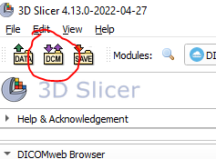
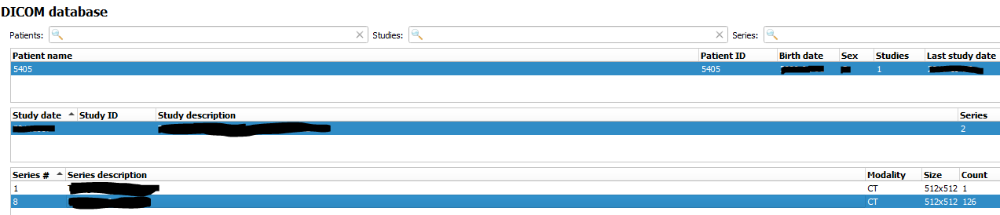
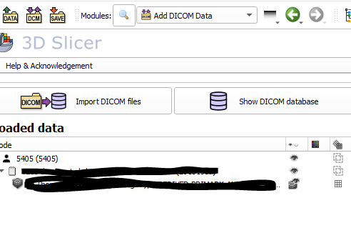

## Utilisation de slicer pour les annotations

Slicer est utilisé comme plateforme d'annotation des images. 

## Démarrage

Pour lancer Slicer, une icône se trouve sur le bureau ou via le menu démarrer sur windows ou avec 
stoplight sur mac (pomme + espace).



Une fois démarré, vous arrivez sur la page d'accueil de slicer 




## Récupérer des images

Pour charger les images, il faut utiliser le module dicomweb, accessible via la recherche (loupe).


Il suffit de rechercher le module souhaité dans le menu déroulant, ou en écrivant son nom, ici ````dicomweb````


Il ne reste plus qu'à double-cliquer ou à cliquer sur ````Switch to module````.
Sur le bandeau de gauche, il y a le bouton ````Show browser```` pour accéder aux données.


Dans la partie ````Server url````, il faut renseigner l'url fournie à la première utilisation et est enregistrée ensuite.




La partie ````Studies```` affiche l'ensemble des études disponibles. En cliquant sur une en particulier, les séries 
associées s'affichent. Il est possible de filtrer à l'aide de la partie ````Filter````. Ce filtre s'applique sur toutes 
les colonnes de la partie ````Studies````. Après avoir sélectionné la ou les séries ou études souhaitées, il faut les 
récupérer localement via le bouton de téléchargement (entouré en rouge dans l'image ci-dessous). Le bouton entouré en 
récupère également et le charge dans slicer directement. Dans l'exemple ci-dessous, au niveau des séries, la série 1 est
présente localement, représenté par l'icone cylindrique, la ligne 2 est en cours de téléchargement et les lignes 3-6 ne 
sont présentes que sur le serveur. Une fois les images récupérées on peut fermer cette fenêtre.


## Charger des images

Pour aller dans la base d'images locales, il suffit de cliquer sur le bouton ````dcm````



Pour charger une série CT, il faut sélectionner le patient, puis l'étude et enfin la série concernée puis cliquer sur ````load````.



La série devrait s'afficher, et la série chargée sur la partie gauche.




[//]: # ()
[//]: # ()
[//]: # ()
[//]: # (You can use the [editor on GitHub]&#40;https://github.com/ylemarechal/synergiqc-slicer-utilisation/edit/main/README.md&#41; to maintain and preview the content for your website in Markdown files.)

[//]: # ()
[//]: # (Whenever you commit to this repository, GitHub Pages will run [Jekyll]&#40;https://jekyllrb.com/&#41; to rebuild the pages in your site, from the content in your Markdown files.)

[//]: # ()
[//]: # (### Markdown)

[//]: # ()
[//]: # (Markdown is a lightweight and easy-to-use syntax for styling your writing. It includes conventions for)

[//]: # ()
[//]: # (```markdown)

[//]: # (Syntax highlighted code block)

[//]: # ()
[//]: # (# Header 1)

[//]: # (## Header 2)

[//]: # (### Header 3)

[//]: # ()
[//]: # (- Bulleted)

[//]: # (- List)

[//]: # ()
[//]: # (1. Numbered)

[//]: # (2. List)

[//]: # ()
[//]: # (**Bold** and _Italic_ and `Code` text)

[//]: # ()
[//]: # (```)

[//]: # ()
[//]: # (For more details see [Basic writing and formatting syntax]&#40;https://docs.github.com/en/github/writing-on-github/getting-started-with-writing-and-formatting-on-github/basic-writing-and-formatting-syntax&#41;.)

[//]: # ()
[//]: # (### Jekyll Themes)

[//]: # ()
[//]: # (Your Pages site will use the layout and styles from the Jekyll theme you have selected in your [repository settings]&#40;https://github.com/ylemarechal/synergiqc-slicer-utilisation/settings/pages&#41;. The name of this theme is saved in the Jekyll `_config.yml` configuration file.)

[//]: # ()
[//]: # (### Support or Contact)

[//]: # ()
[//]: # (Having trouble with Pages? Check out our [documentation]&#40;https://docs.github.com/categories/github-pages-basics/&#41; or [contact support]&#40;https://support.github.com/contact&#41; and we’ll help you sort it out.)
