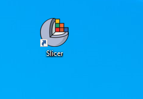
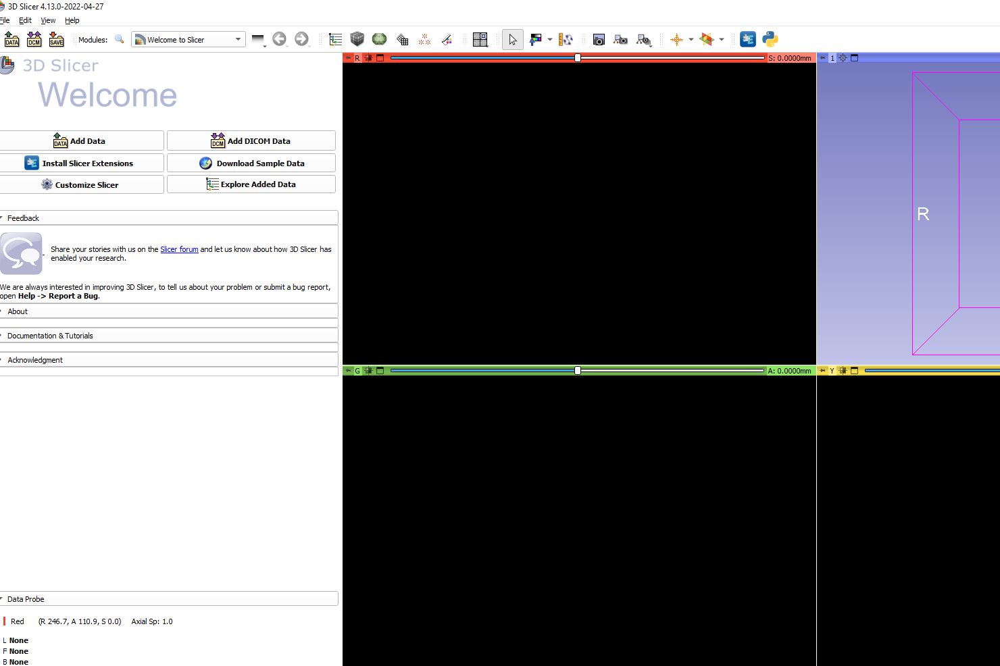
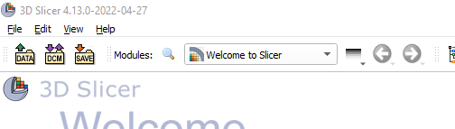
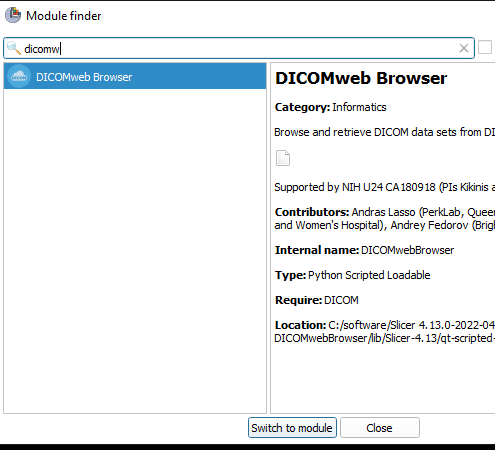
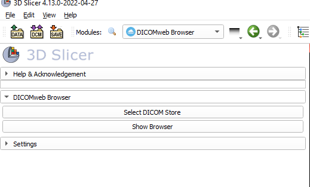
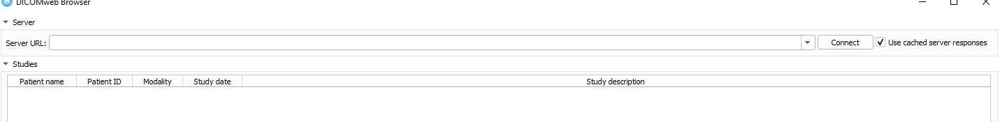
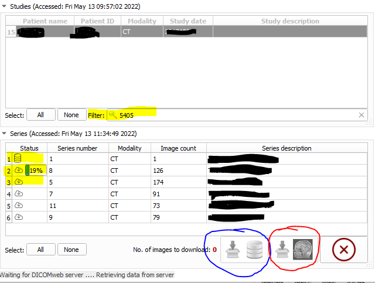

## Utilisation de slicer pour les annotations

Slicer est utilisé comme plateforme d'annotation des images. 

## Démarrage

Pour lancer Slicer, une icône se trouve sur le bureau ou via le menu démarrer sur windows ou avec 
stoplight sur mac (pomme + espace).



Une fois démarré, vous arrivez sur la page d'accueil de slicer 



## Chargement des images

Pour charger les images, il faut utiliser le module dicomweb, accessible via la recherche (loupe).



Il suffit de rechercher le module souhaité dans le menu déroulant, ou en écrivant son nom, ici ````dicomweb````



Il ne reste plus qu'à double-cliquer ou à cliquer sur ````Switch to module````.
Sur le bandeau de gauche, il y a le bouton ````Show browser```` pour accéder aux données.



Dans la partie ````Server url````, faut inscrire l'url fournie.







You can use the [editor on GitHub](https://github.com/ylemarechal/synergiqc-slicer-utilisation/edit/main/README.md) to maintain and preview the content for your website in Markdown files.

Whenever you commit to this repository, GitHub Pages will run [Jekyll](https://jekyllrb.com/) to rebuild the pages in your site, from the content in your Markdown files.

### Markdown

Markdown is a lightweight and easy-to-use syntax for styling your writing. It includes conventions for

```markdown
Syntax highlighted code block

# Header 1
## Header 2
### Header 3

- Bulleted
- List

1. Numbered
2. List

**Bold** and _Italic_ and `Code` text

[Link](url) and 
```

For more details see [Basic writing and formatting syntax](https://docs.github.com/en/github/writing-on-github/getting-started-with-writing-and-formatting-on-github/basic-writing-and-formatting-syntax).

### Jekyll Themes

Your Pages site will use the layout and styles from the Jekyll theme you have selected in your [repository settings](https://github.com/ylemarechal/synergiqc-slicer-utilisation/settings/pages). The name of this theme is saved in the Jekyll `_config.yml` configuration file.

### Support or Contact

Having trouble with Pages? Check out our [documentation](https://docs.github.com/categories/github-pages-basics/) or [contact support](https://support.github.com/contact) and we’ll help you sort it out.
